# ChipSim

**Turn a hardware question into a repeatable, inspectable experiment.** ChipSim is a local terminal workbench for exploring digital behavior from chip datasheets and reference manuals. You can drive inputs, try register sequences, step through a program, and inspect signals alongside the documentation that supports the model.

For a hardware or firmware developer, it helps answer questions such as: “Does clearing this bit change the output latch?”, “Which clock edge captures the data?”, or “What happens when the FIFO fills?” Save the experiment and trace to make the answer reviewable before testing the real device.

Start with [installation](#1-install-and-open-your-first-experiment), follow the [manual walkthrough](#2-follow-a-manual-to-simulation-workflow), or jump to [agent mode](#3-use-agent-mode-with-a-coding-agent). The [inspection guide](#4-inspect-change-and-review-experiments), [builders](#5-build-behavior-that-is-not-already-covered) and [exports](#6-save-share-and-use-waveform-tools) show the features in use.

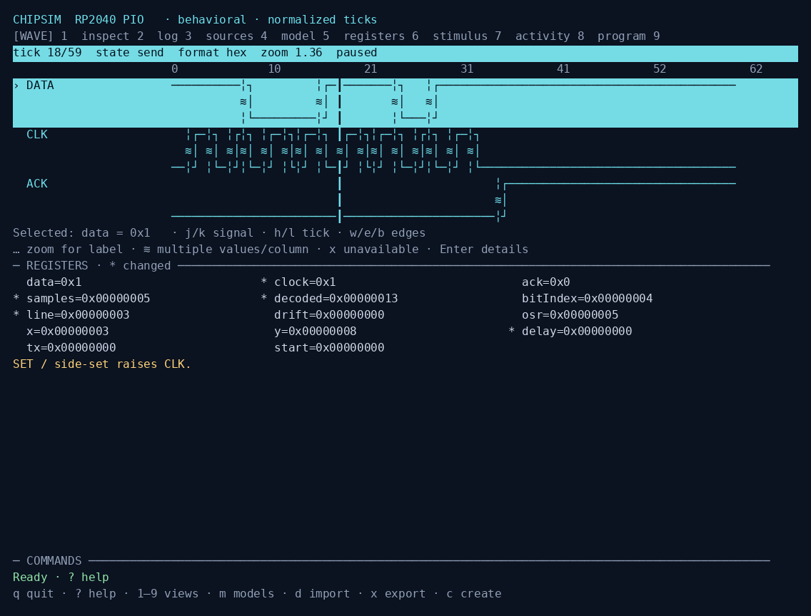

_A supplied RP2040 PIO teaching experiment at tick 18. DATA, CLK and ACK share a timeline with the modeled registers. Each tick is a simulation step, not a measured hardware cycle._

## What you can simulate today

| Starting point                      | What ChipSim provides                                                                                             | Boundary                                                                          |
| ----------------------------------- | ----------------------------------------------------------------------------------------------------------------- | --------------------------------------------------------------------------------- |
| Six architecture examples           | PIO, PRU, FlexIO, PSoC UDB, XMOS and eTPU transfer mechanisms, with parameters and inspectable traces             | Selected teaching implementations; no arbitrary native instruction execution      |
| Exact reviewed vendor PDFs          | 74HC595 shifting/storage; TCA9534 and PCA9555 GPIO registers; ESP32-C6 GPIO output registers and PCNT channel 0   | Only the behavior declared by each model, not the whole chip                      |
| Supported datasheet function tables | Combinational logic, multiplexing/decoding, supported flip-flops, latches and explicitly defined released outputs | Complete, unambiguous supported tables; unsupported rows are rejected             |
| A new peripheral idea               | Guided counter, FIFO, shift-transfer, behavior-table and register-bank builders                                   | Developer-selected rules and assumptions remain visible                           |
| An unfamiliar reference manual      | Searchable source project, model format, verification commands and coding-agent instructions                      | A developer or external agent must author behavior when no supported model exists |
| Verilog / VHDL source and testbench | Icarus Verilog / GHDL runs, VCD inspection, mapped signal comparison                                              | Recorded digital results; explicit timing assumptions for model comparisons       |

The library includes **34 original vendor PDFs across 19 chip/family folders**, with source URLs, revisions, fingerprints and programming references. Start with the [chip and reference library](docs/references/README.md) and [example programs](examples/programs/README.md). The full account-gated NXP eTPU reference manual is not bundled; the catalog records the available public documents and gaps.

## 1. Install and open your first experiment

You need **Node.js 22.13 or newer**. Importing PDFs also needs Poppler's `pdfinfo` and `pdftotext`. On Debian/Ubuntu, the Poppler package is `poppler-utils`.

Install from this repository; there is no npm registry release:

```sh
git clone https://github.com/muchmirul/chipsim.git
cd chipsim
npm install --global --prefix "$HOME/.local" --ignore-scripts "$PWD"
export PATH="$HOME/.local/bin:$PATH"
chipsim agent doctor
chipsim --model pio
```

Keep the checkout if using this local installation. Add the PATH line to your shell configuration if you want it available in future terminals. Without installing, run `node scripts/chipsim.mjs` from the checkout. The terminal app has no npm runtime dependencies; contributor and browser tools use `npm ci`.

Use a terminal of at least **80 × 24**; the screenshots below use **110 × 36**. Press `?` for help and `q` to quit.

Try these actions in order:

1. Press **Space** to play or pause the PIO example. Use `h/l` or left/right arrows to inspect one tick at a time.
2. Press `p` and change a parameter such as the payload. The experiment is recomputed so you can compare its behavior.
3. Press `1` for waveforms, `2` for hardware blocks, `3` for events or `6` for exact register values. These views describe the same experiment at the same cursor.
4. Press `m` to choose another architecture. Observe how its execution mechanism changes.

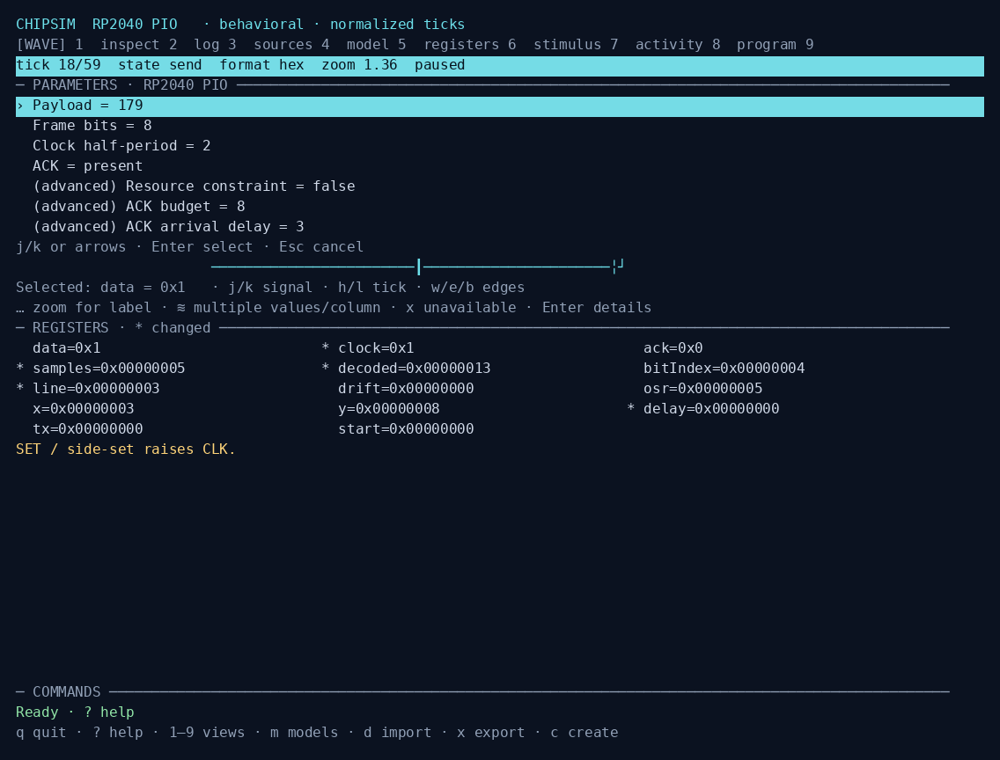

_Parameters define the experiment. Number entry accepts decimal, hexadecimal (`0xB3`), binary (`0b10110011`) and octal (`0o263`); plain `179` is decimal. Uppercase `F` changes the displayed base without changing the underlying values or cursor._

## 2. Follow a manual-to-simulation workflow

The process has separate evidence, modeling and execution steps:

```text
Original PDF
  └─ if scanned: external OCR → searchable PDF
       ↓
ChipSim prepare/import → numbered text pages + selected table geometry
       ↓
Supported profile/table → model, or developer/agent authors a bounded model
       ↓
Source quotations + model acceptance cases checked
       ↓
Input events or .chip program → simulated trace
       ↓
TUI review → adjust experiment → save session / export JSON, CSV, VCD
```

**OCR is not run by ChipSim.** A searchable PDF goes straight to text extraction. For a scanned PDF, run OCR externally **before** `agent prepare` or TUI import (`d`), then use the resulting searchable PDF as the project's source. ChipSim fingerprints those exact input bytes. A PDF with no searchable text is rejected.

In the terminal workflow, Poppler reads metadata and extracts existing text with `pdftotext`. ChipSim keeps one-based PDF page numbers, including front matter, and obtains word positions with `-bbox-layout` for selected function/register-table candidates. This supports structured table review; it is not image recognition or automatic understanding of every diagram. See [function-table extraction](docs/FUNCTION_TABLES.md) and [register inventories](docs/REGISTER_BANKS.md).

### Step A — Prepare the supplied ESP32-C6 manual

Run the following from the repository checkout. Choose a new output directory; preparation preserves existing directories.

```sh
chipsim agent prepare docs/references/esp32-c6/espressif-esp32-c6-trm.pdf \
  --out ../chip-work
chipsim agent context ../chip-work --model esp32c6-gpio
chipsim agent search ../chip-work "GPIO_OUT_REG" --limit 5
chipsim agent page ../chip-work 271
```

Preparation copies the PDF, extracts sources, records its fingerprint and creates `AGENTS.md`, `PROGRAMMING_CONTEXT.md`, `analysis.json`, numbered pages and any supported models. This exact manual supplies both **GPIO** and **PCNT** models; selecting GPIO makes the intended scope explicit.

`context` tells you the chip's programming target, available simulation capabilities, exact register/input names, guide PDFs and limits. Read it before writing a program; chip families do not share an interchangeable firmware format.

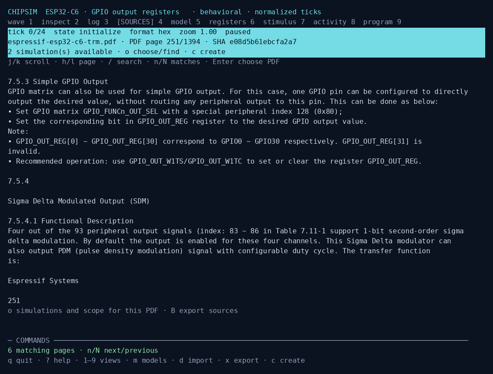

_Sources (`4`) keeps the manual beside the experiment. `/` searches text, `n/N` cycles matching pages, `h/l` changes pages and `j/k` scrolls. Page 251 describes simple output and recommended set/clear operations; page 271 gives their register definitions. PDF page numbers may differ from printed page labels._

### Step B — Load a register experiment

```sh
chipsim --document ../chip-work/manual.pdf \
  --model ../chip-work/models/esp32c6-gpio.model.json \
  --program examples/esp32c6-gpio.chip
```

The [supplied `.chip` source](examples/esp32c6-gpio.chip) enables GPIO0's **logical output driver**, sets it high, checks the signal, waits three ticks, clears it, then reads and checks the output latch. It is an experiment script, not ESP-IDF firmware or RISC-V assembly. The GPIO model assumes a preconfigured simple-output path; IO MUX setup and physical routing are outside its scope.

### Step C — Step and inspect the result

Loading source does not execute its statements. In **Program (`9`)**, press `N` to execute one statement. Select line 9 with `j/k`, press `K` to set a breakpoint, then `C` to continue.

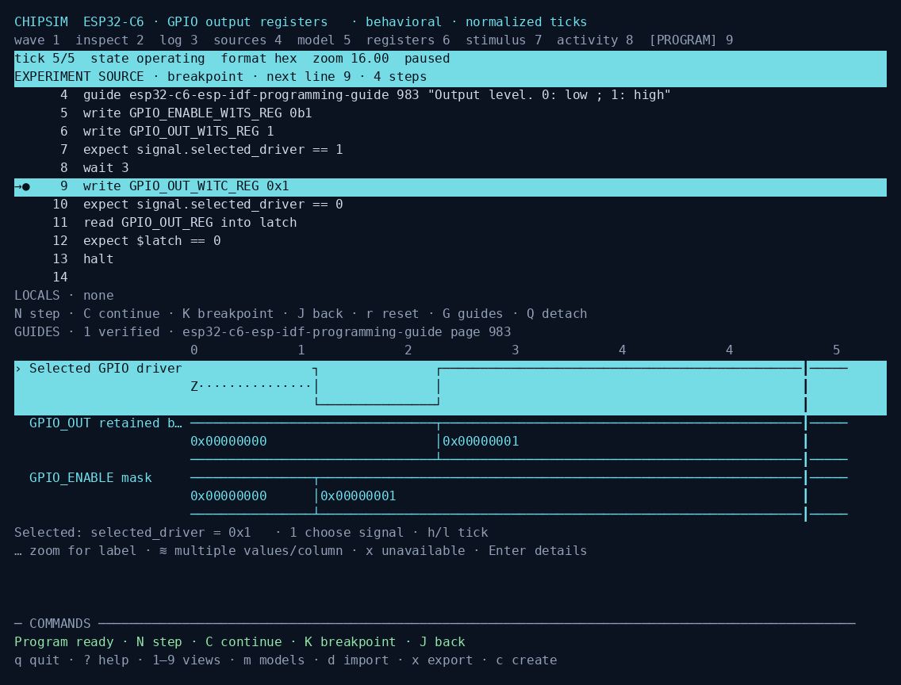

_The program is stopped before line 9 at tick 5. The trace shows the driver starting released (`Z`), becoming low after enable, then high after set. `N` executes the clear and produces low; `J` replays one executed statement backward. Source steps and signal ticks are related but not identical: an assertion can execute without advancing time._

Press `6` for register values, then Enter for a complete step explanation. Return to Program with `9` and press `G` to review verified guide references. Press `r` to reset the program. To edit inputs directly, press `Q` in Program to detach it, or edit and reload the source with `P`.

### Step D — Check and run without a terminal

```sh
chipsim agent program-check examples/esp32c6-gpio.chip \
  --model ../chip-work/models/esp32c6-gpio.model.json --project ../chip-work
chipsim agent program-run examples/esp32c6-gpio.chip \
  --model ../chip-work/models/esp32c6-gpio.model.json --project ../chip-work \
  --out ../chip-work/runs/gpio-pulse
chipsim --document ../chip-work/manual.pdf \
  --model ../chip-work/runs/gpio-pulse/session.json
```

`program-check` verifies source syntax, model capabilities, original PDF evidence, model acceptance cases and applicable guide quotations. **Program assertions execute during `program-run`**, not during the syntax/capability check. A successful run saves its source, line/tick mapping, JSON/CSV/VCD traces and a replayable TUI session. Use a new run directory for each experiment.

This gives a reviewable result: the model's declared behavior, the exact input sequence, observed values, assertions and source references travel together. The [programming guide](docs/PROGRAMMING.md) explains the language and debugger in detail.

## 3. Use agent mode with a coding agent

**Agent mode is a local command interface, not an agent built into ChipSim.** Your chosen coding agent reads the manual and writes model JSON or `.chip` source; ChipSim extracts evidence, checks it, executes the experiment and exposes results. No LLM integration, provider account, API key or agent-specific extension is required by ChipSim.

It works with an agent that can **read/write local files and execute processes** on a machine with ChipSim and Poppler. Agents with shell tools can run `chipsim agent …`; Python-based tools can call the same executable with `subprocess.run`. The agent retains its own permissions and document-handling configuration.

### Give the agent its context

Prepare a project as above, or use your own searchable manual:

```sh
chipsim agent prepare /absolute/path/to/manual.pdf --out /absolute/path/to/new-chip-work
```

For the GPIO project prepared above, change from the checkout into its work folder:

```sh
cd ../chip-work
chipsim agent context . --model esp32c6-gpio
```

Launch your coding agent here using its usual command, or open this folder in your editor's agent. You can also explicitly point an already-running agent at this project. Tell it to read the project instructions; not every agent automatically discovers `AGENTS.md`. For the GPIO project, this is a complete starting prompt:

> Work in the prepared chip-work folder. Read AGENTS.md, PROGRAMMING_CONTEXT.md, docs/PROGRAMMING.md and analysis.json. Run `chipsim agent context . --model esp32c6-gpio` to refresh the actual capabilities. Reuse the GPIO model only within its declared scope. Write `programs/gpio-pulse.chip` to enable GPIO0, set it, wait, clear it and assert the logical driver and readback. Use the applicable original guide with an exact quote and PDF page. Run program-check, then program-run into a new directory under runs/. Inspect the trace and debug report. Return the commands, passed/failed assertions, artifacts, source references and omitted behavior.

For **another chip or an unsupported peripheral**, replace the chip-specific task with a bounded behavior you need. Ask the agent to search and review the manual, author `models/your.model.json` using `docs/MODEL_FORMAT.md`, and add independently justified reset, normal, boundary and disabled/failure cases. Then have it run:

```sh
# Run inside the prepared project, after the agent has written the model.
chipsim agent context .
chipsim agent check models/your.model.json --project .
chipsim agent run models/your.model.json --project . --out runs/first --ticks 40
```

An unknown manual may produce **no executable model at prepare time**. The agent must supply one and state any unsupported behavior or assumptions. Extracted register addresses alone do not establish side effects, ordering or reset semantics. Native firmware requests need a separate execution backend; the agent should report that gap before substituting a behavioral experiment.

### Example — Pi coding agent

With Pi installed and its model connection configured, start it in the prepared GPIO project:

```sh
cd /absolute/path/to/chip-work
pi --tools read,bash,edit,write \
  'Read AGENTS.md and PROGRAMMING_CONTEXT.md. Run chipsim agent context . --model esp32c6-gpio. Write programs/gpio-pulse.chip to enable GPIO0, set it high, wait three ticks, clear it, and assert driver values and latch readback. Cite the applicable guide. Run program-check and program-run into a new runs/ directory. Report scope, checks, artifacts and the command to open the saved session.'
```

Pi uses its file tools to read the instructions/manual and write source; its `bash` tool invokes ChipSim. You can steer the same session, for example: “Now check the released driver before enable.” These are commands for the [Pi coding agent](https://github.com/earendil-works/pi/blob/main/packages/coding-agent/docs/cli.md); its own setup and provider connection are separate from ChipSim.

### Example — Codex coding agent

With Codex CLI installed and signed in, run the same task from the prepared project:

```sh
cd /absolute/path/to/chip-work
codex \
  'Read AGENTS.md and PROGRAMMING_CONTEXT.md. Run chipsim agent context . --model esp32c6-gpio. Write programs/gpio-pulse.chip to enable GPIO0, set it high, wait three ticks, clear it, and assert driver values and latch readback. Cite the applicable guide. Run program-check and program-run into a new runs/ directory. Report scope, checks, artifacts and the command to open the saved session.'
```

Codex reads project instructions and uses its command/file tools for the same workflow. Allow project writes and local ChipSim commands under your normal agent permissions. In the Codex IDE extension, open the prepared folder and paste the same task. See [official Codex CLI setup](https://learn.chatgpt.com/docs/codex/cli) and [project instructions](https://learn.chatgpt.com/docs/agent-configuration/agents-md).

Both examples use the already-supported GPIO model. For a new chip, change the task to the bounded behavior you need and require model authoring plus `agent check`/`agent run` before programming. ChipSim checks the agent's result; choosing a different agent does not change the simulation engine.

### Watch what the agent publishes

Open a second terminal:

```sh
chipsim --watch /absolute/path/to/chip-work
```

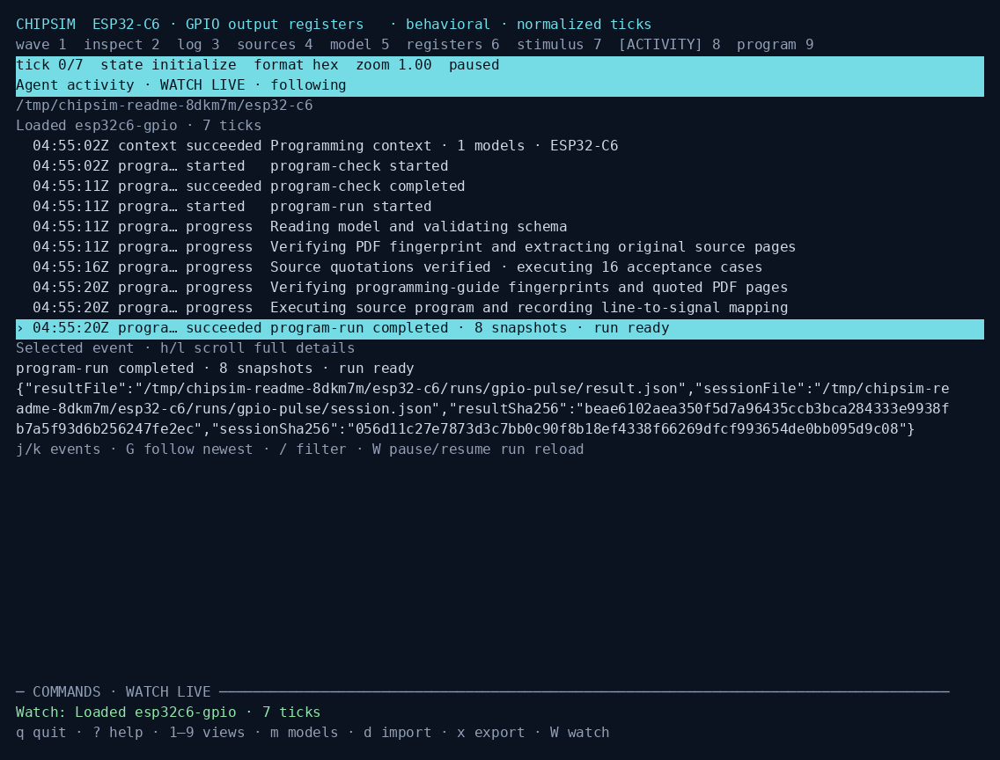

_Activity (`8`) shows actual source lookups, model-file changes, check/run progress and results. A complete successful run loads after verification; incomplete edits and failed runs leave the current trace intact. Switch to `1`, `6` or `9` to inspect the published experiment._

Press `W` to pause automatic run reload before local edits; activity keeps updating. `j/k` selects events, `/` filters and `G` follows the newest event. The monitor observes ChipSim commands and model-file changes, not every editor action or the agent's private reasoning. The agent can add a visible milestone with `chipsim agent note . "Reviewing reset semantics"`.

### Connect an agent's tools

| Agent tool available                           | How to invoke ChipSim                                                             |
| ---------------------------------------------- | --------------------------------------------------------------------------------- |
| Shell/command execution, including Codex or Pi | Run the `chipsim agent …` commands directly; explicitly read project instructions |
| Python process execution                       | Call `subprocess.run(["chipsim", "agent", …], capture_output=True, text=True)`    |
| Filesystem access without process execution    | Edit files, then have a person or another command runner perform checks/runs      |

Every agent command returns **one JSON object** on stdout and a meaningful exit status. Check `ok` and `diagnostics`; do not treat an artifact's existence as success. Search/page responses are bounded; follow `nextOffset` when present. `chipsim agent help` describes commands without requiring a TTY.

For example, a Python-based agent tool can retrieve capabilities while working in the prepared GPIO project:

```python
import json
import subprocess

completed = subprocess.run(
    ["chipsim", "agent", "context", ".", "--model", "esp32c6-gpio"],
    capture_output=True,
    text=True,
)
result = json.loads(completed.stdout)
if completed.returncode != 0 or not result["ok"]:
    raise RuntimeError(result.get("diagnostics", []))
print(result["programmingContext"])
```

Strict model check/run freshly extract the pinned original PDF, match quoted pages, validate the model and execute its acceptance cases. Program operations additionally verify the original guides. A matching quotation proves **textual provenance**; acceptance cases prove the tested expectations. Neither establishes complete silicon fidelity. See [agent protocol, invocation examples and monitoring details](docs/AGENT_WORKFLOW.md).

## 4. Inspect, change and review experiments

### Waveforms, hardware blocks and event history

In Waveforms (`1`), `j/k` selects a signal, `+/-` zooms and `=` fits the trace. `w/e/b` jumps to rising/falling/previous rising edges; `[` and `]` jump across model changes. `/` finds a signal by name, `n/N` cycles name matches, and `f` finds the selected signal's next matching value. `t` goes to a tick; `T` changes a document model's duration. These tools help locate the exact step where your expected behavior diverges.

`Z` means a released output driver. `x` means unavailable data within the trace. A `≋` marker means a screen column covers different values; zoom in to inspect them. Released outputs do not imply pull-ups or physical node voltage.

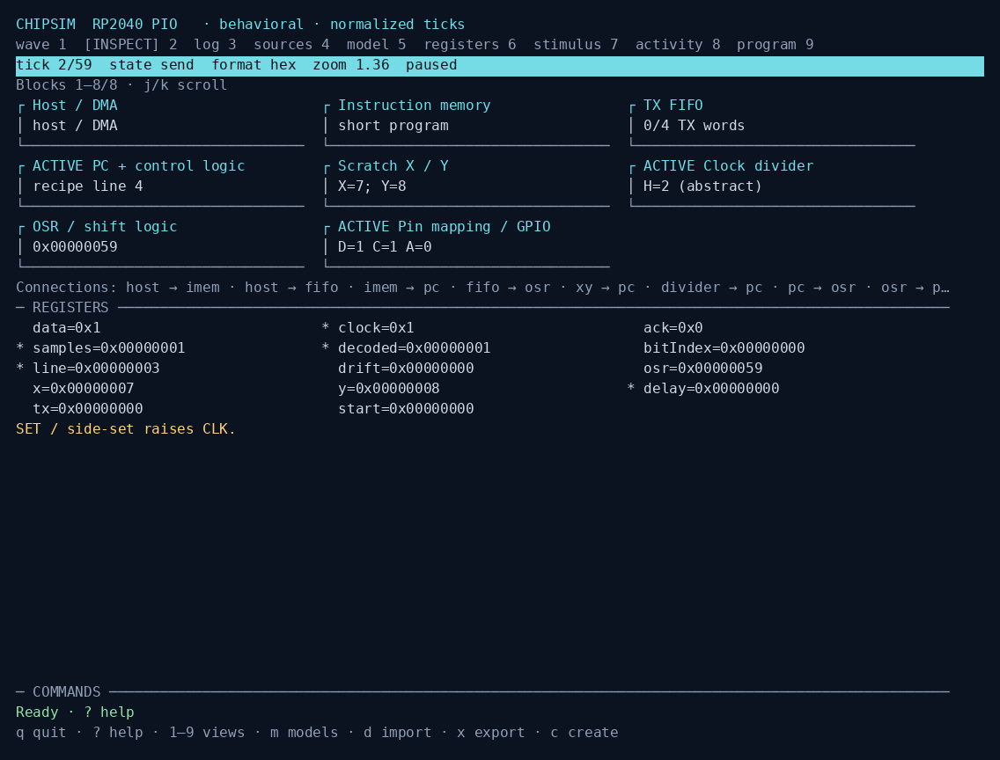

_Hardware blocks (`2`) ties the selected tick to modeled resources, values and connections. ACTIVE means the resource participated at that tick. This is the model's declared topology, not an extracted transistor layout._

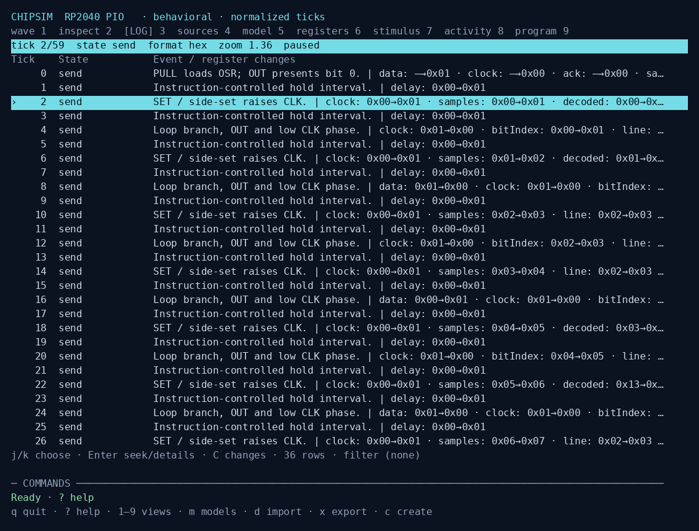

_Log (`3`) gives the sequence behind the waveform. `/` filters; `C` toggles changes-only mode. Select an event and Enter to seek its tick and read full step details. This is useful when several register effects appear at one transition._

### Addressed registers and complete step details

Models with a register interface support `u` for named reads/writes. Addresses are interpreted according to that model; the GPIO example uses relative offsets. Write-only set/clear aliases do not acquire invented readback values.

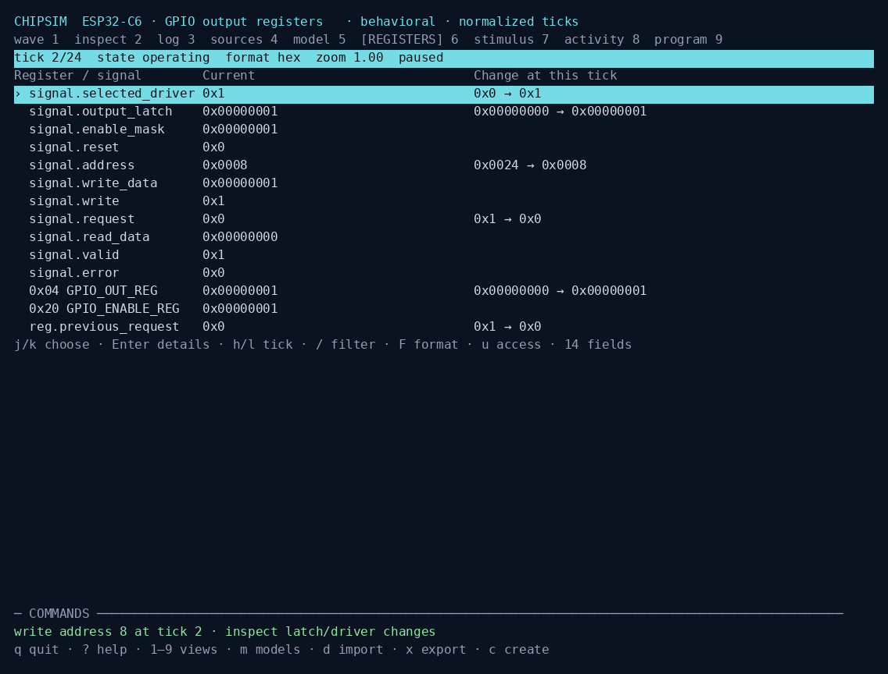

_Registers (`6`) lists current values and changes at the cursor. After enabling GPIO0 and writing OUT_W1TS=1, the logical driver and retained latch are high. `/` filters fields; `F` cycles numeric presentation._

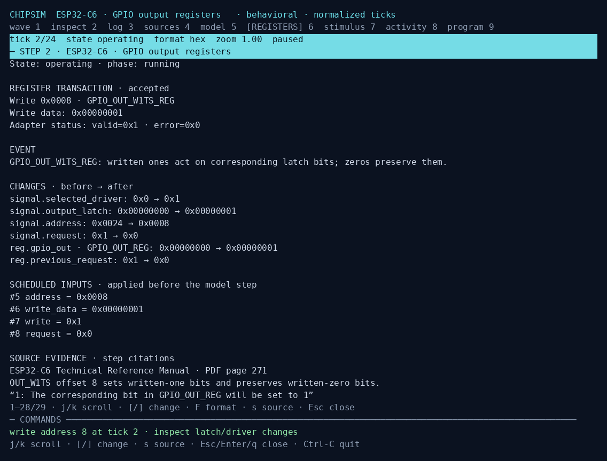

_Enter opens a complete step: accepted write, adapter status, before/after values, input events and actual source evidence. Press `s` to open an available step citation in Sources. An ignored or rejected read is not presented as a new read result._

### Input timeline and undo/redo

Use `i` to drive a pin at the cursor or schedule it from **Stimulus (`7`)**. Input values hold until their next event. Enter edits/moves/removes the selected event; `a` loads a JSON sequence, restores demonstration events or clears explicit events. JSON numbers use decimal syntax; terminal input accepts all four numeric bases.

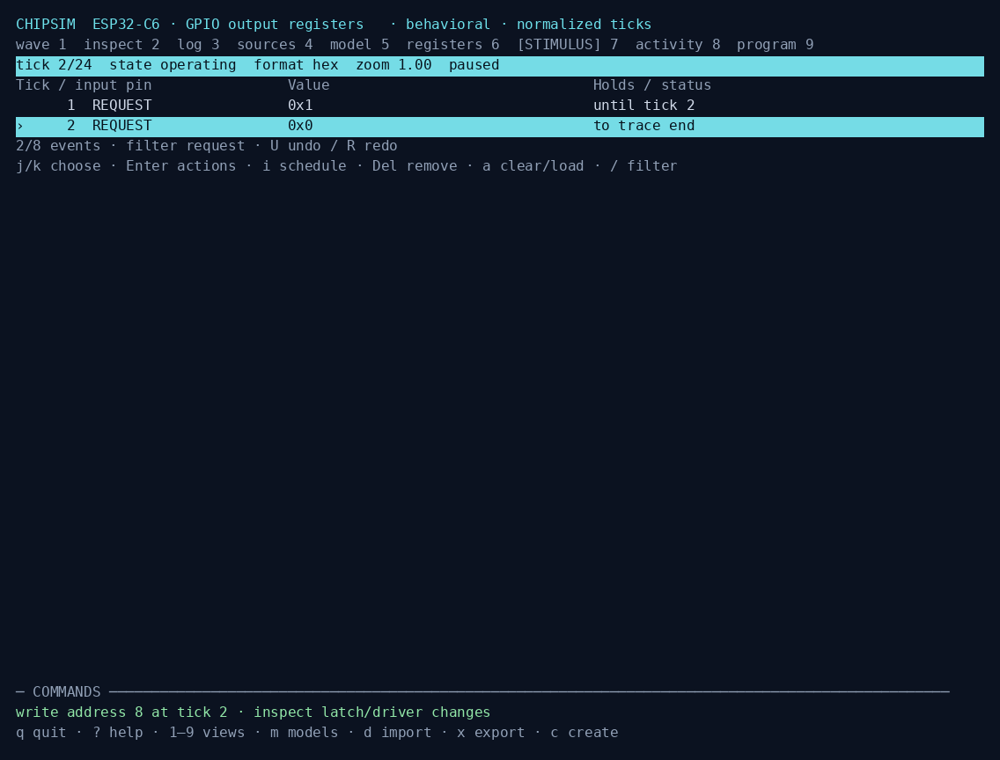

_The timeline exposes the actual inputs behind an experiment. This filtered view shows the request-token changes generated by the two register writes. Use `u` to insert a complete transaction rather than manually assembling bus fields. `U` undoes and `R` redoes a stimulus edit; `S` saves the resulting experiment. Undo history itself is temporary._

### Source-linked model selection and scope

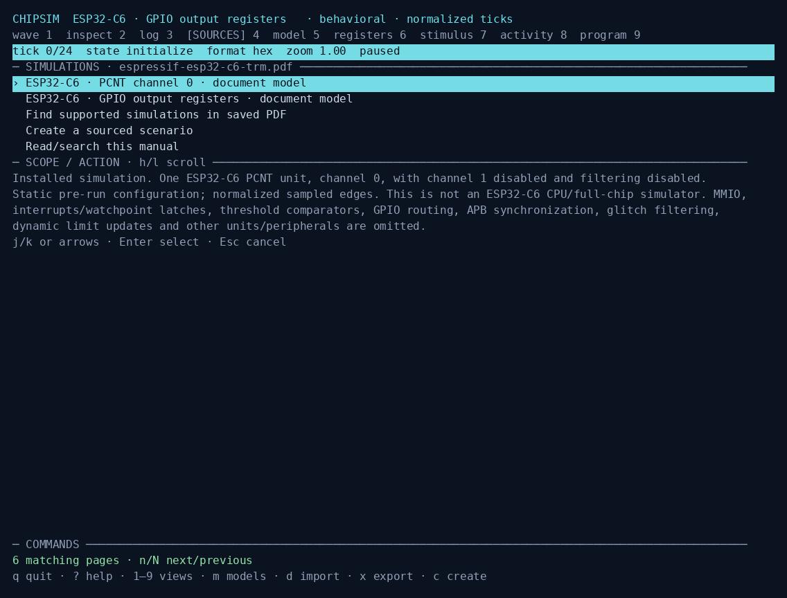

_From Sources, `o` selects simulations associated with that PDF and shows their scope. “Find supported simulations in saved PDF” rechecks the saved source for supported models. One manual can supply several independent peripheral models; opening it does not create a whole-SoC simulator._

Model (`5`) explains scope, assumptions, parameters, source hashes, evidence and implementation states. Review it before relying on an output. `M` exports a document model; `B` exports the current document's source bundle.

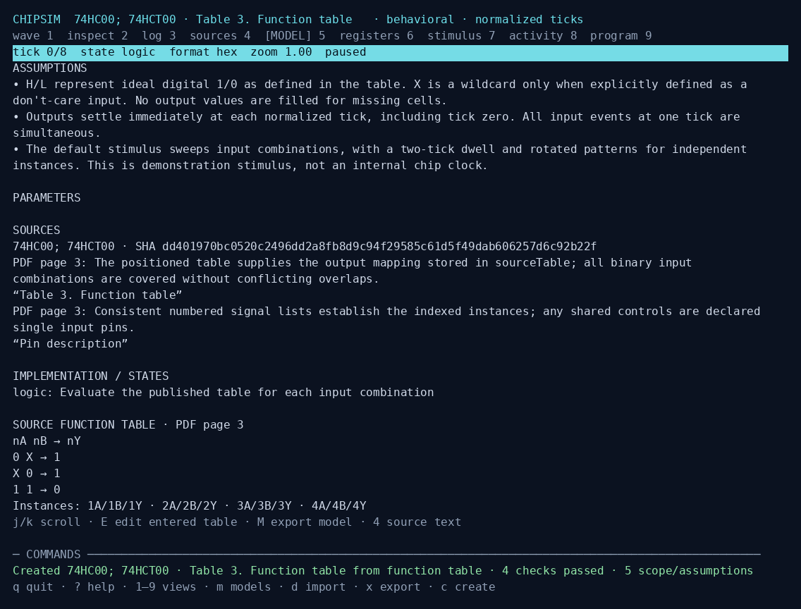

_For supported logic tables, the model retains original rows and validated instance mapping. The 74HC00 example derives NAND outputs from the source table. Sequential examples expose retention/clock history and explicit initial-state choices. Ambiguous or unsupported tables are rejected rather than completed by guesses._

### Program debugging and guide evidence

The Program view shown in the walkthrough supports line stepping, breakpoints, continue, backward replay, locals and assertions. `.chip` uses `drive`, `write`, `read`, `wait`, `expect` and bounded branching; operations depend on the chosen model. A pin-only logic chip has no addressed register interface.

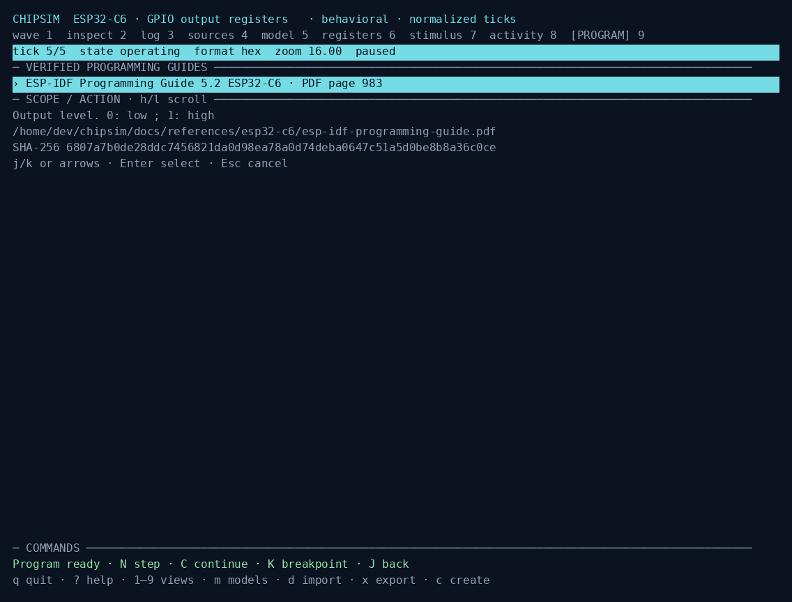

_`G` in Program displays guide evidence that was checked against the original PDF. Guide IDs and paths come from chip context. A program must declare an applicable guide; for an unfamiliar prepared manual, its programming section can be referenced with `guide manual PAGE "quote"`. These references support review, not native firmware execution._

## 5. Build behavior that is not already covered

Import a manual with `d`, then press `c`. Choose a builder, configure the experiment and provide the source page, quote, claim and assumptions. Source verification and generated consistency cases run before installation. Add independent cases when fidelity to a real peripheral matters.

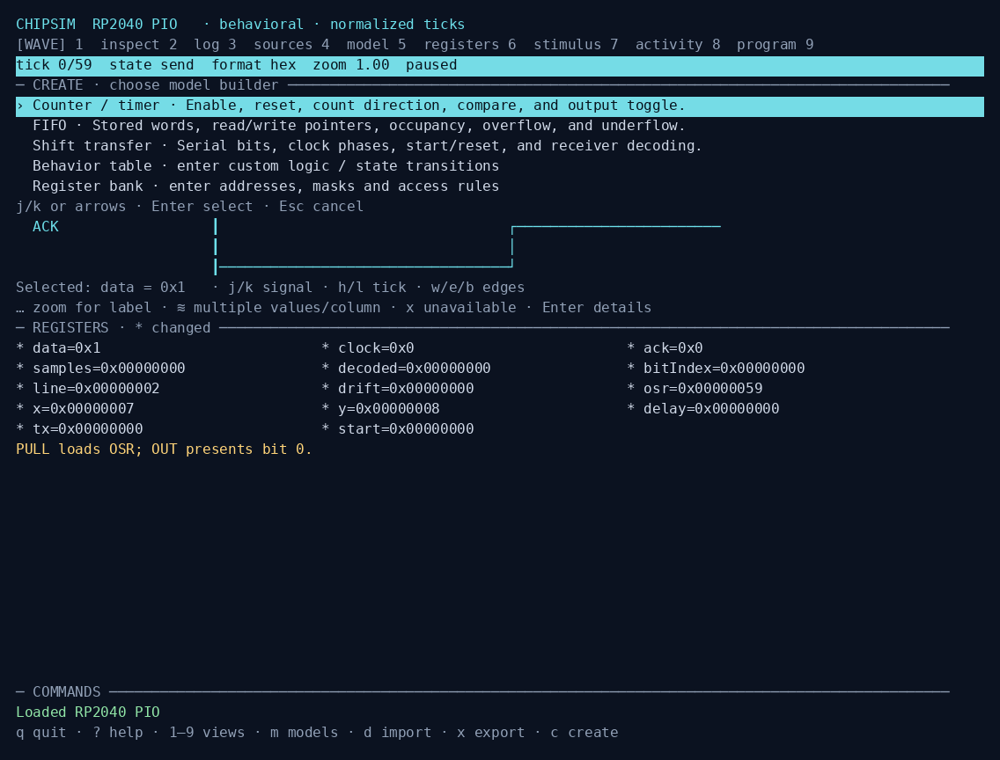

_Guided builders reduce repetitive model authoring. Their configurable behavior is explicit; a relevant quote does not mean every selected rule was inferred from that document._

### Counter, FIFO and shift transfer

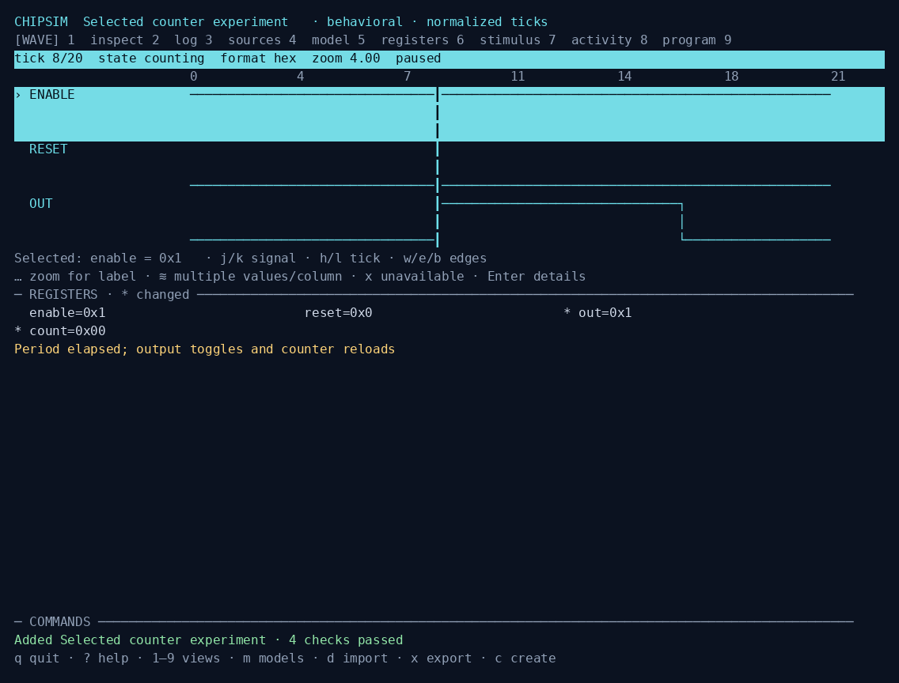

_Counter/timer: explore enable, reset, count direction, compare/reload or halt. This selected eight-bit scenario toggles at period 8. It uses an RP2040 excerpt as context, with developer-selected rules; it is not the complete RP2040 timer._

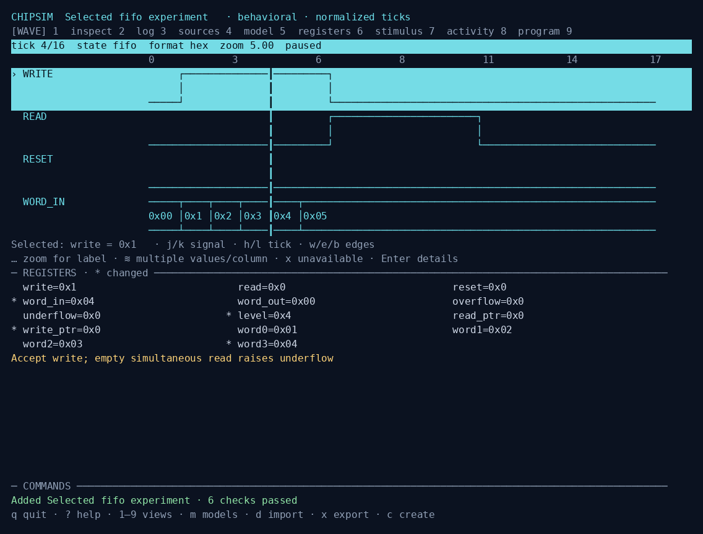

_FIFO: inspect stored words, read/write pointers, occupancy, overflow, underflow and simultaneous requests. At tick 4, this selected four-word, eight-bit FIFO is full. Its ordering rules are the builder's declared assumptions._

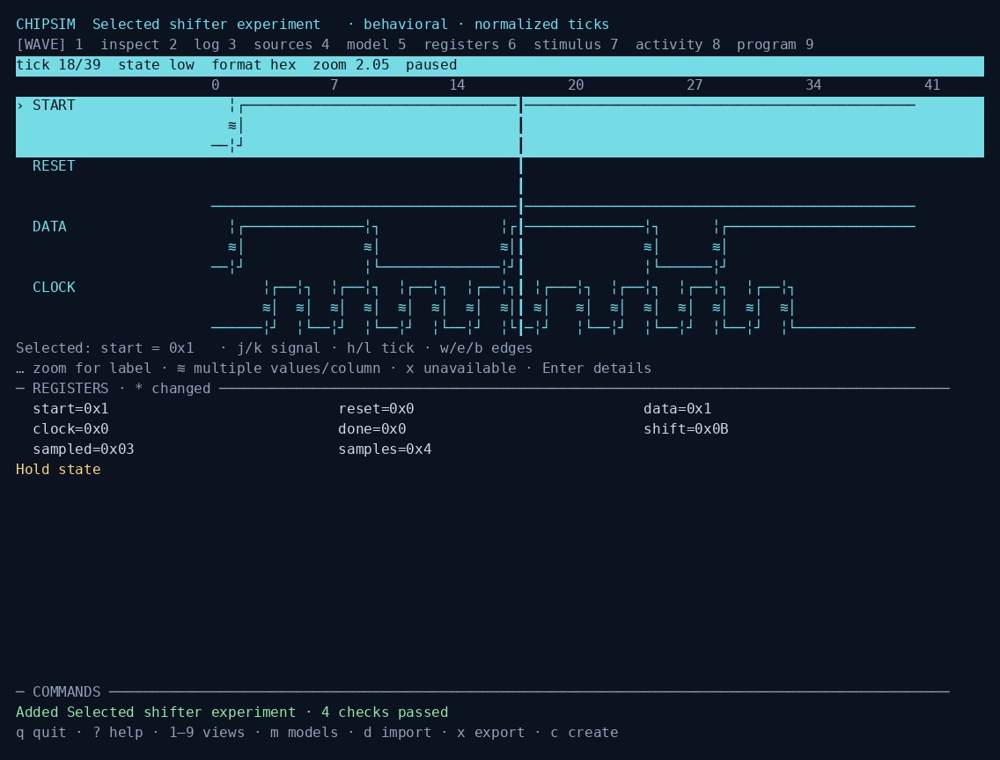

_Shift transfer: vary word width, bit order, payload and clock half-period; observe serial bits and receiver decoding. The builder does not infer a complete SPI controller, bus timing or chip-select protocol._

### Explicit register banks and structural drafts

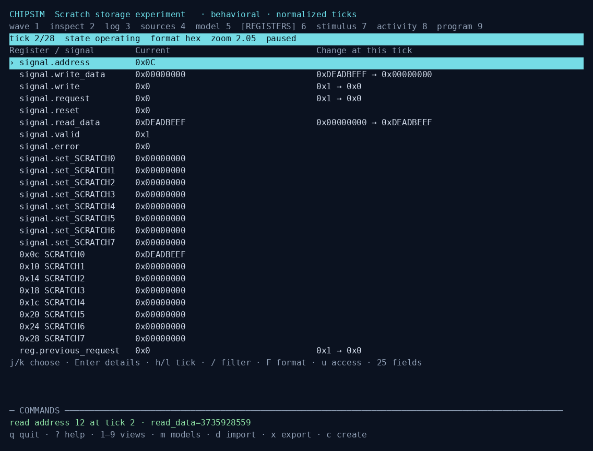

_Register bank: enter explicit `NAME ADDRESS MODE RESET MASK` rows, with read/write, read-only, write-one-to-clear/set and read-to-clear modes. This eight-word storage experiment writes and reads `0xDEADBEEF` using documented RP2040 scratch offsets. Its synthetic reset is a scenario choice, not the chip's soft-reset behavior._

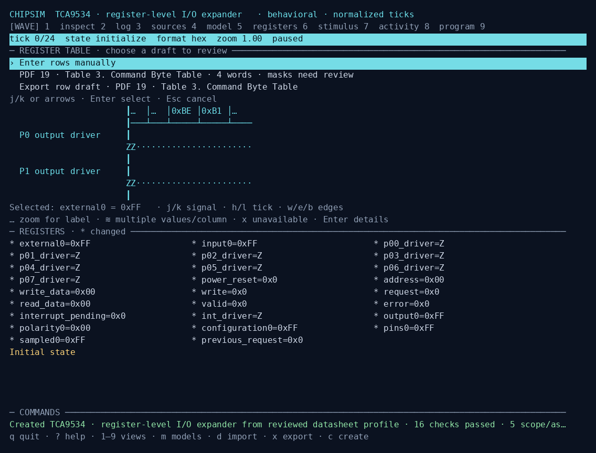

_Supported structural register tables can prefill a review draft with addresses, labels and known defaults. Missing resets and masks remain unresolved. You must review and supply them before building; a structural inventory does not infer GPIO, interrupt or other peripheral behavior. See [register-bank authoring](docs/REGISTER_BANKS.md)._

### Custom logic/state machines and revision review

Behavior table lets you enter named states and complete rows such as `idle 01 -> armed / 1`. Input `X` is a wildcard; output `=` explicitly retains a value. Missing holds, reset rules, clock edges and row priority are not inferred. Load rows from an `@file` for easier editing.

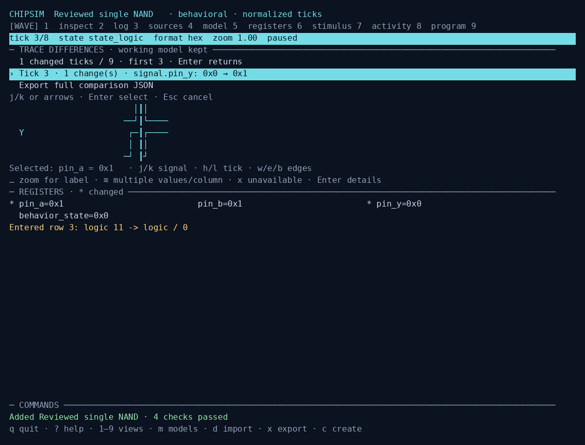

_Press `E` to revise an entered table and compare a draft against the same parameters, stimulus and duration. This deliberate what-if draft forces NAND Y high; the differences show where it disagrees with the working model. It is not vendor behavior and is not installed by preview. Compatible saved revisions retain backups. See [behavior-table rules and revision workflow](docs/BEHAVIOR_TABLES.md)._

## 6. Save, share and use waveform tools

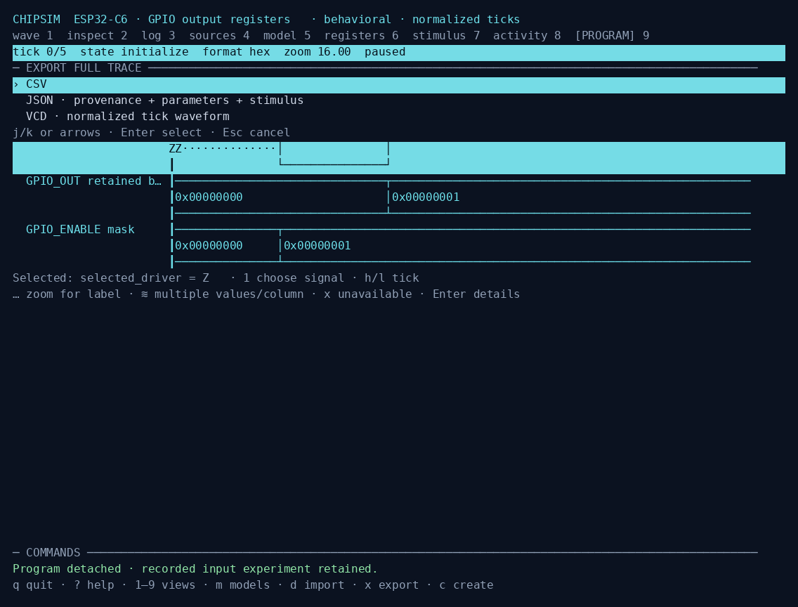

_`x` exports the complete executed trace as CSV, JSON or VCD. `S` saves a replayable session. VCD is a waveform interchange file; it contains signal changes, not the executable model or programming source. JSON retains model provenance and experiment configuration._

Model-generated VCD uses a nominal `1ns` timescale for viewer compatibility; each timestamp unit remains an **abstract model tick**, not a nanosecond timing claim. Imported HDL waveforms instead preserve their simulator timescale and timestamps. The terminal shows timestamp sample indices horizontally and exact simulator time at the cursor.

### Run HDL and compare signals

Press **H** in the terminal to import VCD, run an HDL project, or compare the active trace with another waveform/model trace. Install Icarus Verilog and GHDL to run the supplied open-source examples; waveform import works without them.

```sh
chipsim hdl doctor
chipsim hdl run examples/hdl/adder-verilog.project.json --out tmp/verilog-run
chipsim hdl run examples/hdl/adder-vhdl.project.json --out tmp/vhdl-run
chipsim --vcd tmp/verilog-run/waveform.json
chipsim hdl compare tmp/verilog-run/trace.vcd tmp/vhdl-run/trace.vcd --map examples/hdl/adder-compare.json
```

Use new output directories on each run. The cocotb CC0 adders exercise all 256 four-bit input pairs; their testbenches also record a clock, edge counter, NAND probes and mixed unknown/released bits. Comparisons require explicit signal names and compatible widths; comparing with abstract model ticks also requires a chosen tick duration. See [HDL projects and comparison](docs/HDL.md) and the [example walkthrough](examples/hdl/README.md), including HDL versus a datasheet-derived ChipSim NAND model. `npm run test:hdl` verifies both real simulators.

For external waveform viewing, install [dwfv](https://github.com/psurply/dwfv) separately and press `V`; quit dwfv to return to ChipSim. Use `--dwfv /path/to/dwfv` or `CHIPSIM_DWFV` for a chosen executable. ChipSim's TUI is its own implementation; no dwfv source is copied into it. See [interop and reviewed version](docs/TUI.md#dwfv) and [vendor/software notices](THIRD_PARTY_NOTICES.md).

Useful files have distinct jobs:

| File                           | Purpose                                                                       |
| ------------------------------ | ----------------------------------------------------------------------------- |
| `manual.pdf`                   | Original reference bytes used for provenance verification                     |
| `sources.json`, `pages/*.txt`  | Searchable extraction and selected table geometry                             |
| `models/*.model.json`          | Declared executable behavior, scope, evidence and acceptance cases            |
| `programs/*.chip`              | Repeatable experiment source                                                  |
| `trace.json` / `.csv` / `.vcd` | Observed simulation results in different formats                              |
| `debug.json`                   | Program line/tick mapping, execution status and locals                        |
| `session.json`                 | Model and experiment configuration, plus replayable program data when present |
| `result.json`                  | Run outcome, verification summary and artifact paths                          |

By default the TUI caches PDFs, models and exports under `.chipsim/` in its launch directory. Use `--workspace PATH` for another location. Prepared agent projects and run folders are separate artifacts. **Sessions do not embed PDFs**; attach the original manual when reopening on another machine to verify source evidence. Terminal and optional browser storage are separate.

## Current limits and next steps

ChipSim models ideal digital behavior within a declared scope. It does not simulate analog voltage, power, area, transistor layouts or a complete SoC. Its terminal/headless HDL workflow runs Verilog/SystemVerilog through Icarus Verilog and VHDL through GHDL, preserving dumped simulator timestamps. Native C/C++, assembly, ELF/BIN, XMOS XE or eTPU microcode execution remains unsupported. The six architecture demonstrations do not accept arbitrary replacement native programs.

PDFs must contain searchable text and be at most **80 MiB**. OCR is external preprocessing, and diagrams may require direct review in the original PDF. Strict prepared-project checks currently bind a model to one manual; not every PDF revision or table form is supported. “No supported model” is a valid import result, followed by explicit developer/agent authoring.

For hardware validation, compare independently chosen expectations with vendor examples, errata and real-device measurements where appropriate. Use ChipSim to organize and inspect a hypothesis; a green check alone does not certify it.

| Continue with                                        | Documentation                                                                              |
| ---------------------------------------------------- | ------------------------------------------------------------------------------------------ |
| All terminal keys and source/persistence behavior    | [TUI](docs/TUI.md)                                                                         |
| Coding-agent protocol and subprocess examples        | [Agent workflow](docs/AGENT_WORKFLOW.md)                                                   |
| Experiment source and debugging                      | [Programming](docs/PROGRAMMING.md)                                                         |
| Author/extend a declarative model                    | [Model format](docs/MODEL_FORMAT.md)                                                       |
| Automatic profile and table boundaries               | [Reviewed profiles](docs/DOCUMENT_PROFILES.md), [function tables](docs/FUNCTION_TABLES.md) |
| ESP32-C6 scenarios                                   | [GPIO](docs/ESP32_C6_GPIO.md), [PCNT](docs/ESP32_C6_PCNT.md)                               |
| References, revisions and native programming targets | [Reference library](docs/references/README.md)                                             |
| Contributor setup, optional browser and verification | [Development](docs/DEVELOPMENT.md)                                                         |
| Reproduce these terminal images                      | [Screenshot capture](docs/screenshots/README.md)                                           |

For contributors: `npm ci`, `npm test` and `npm run verify`. The optional browser uses the same simulation core; build and launch it with `npm run build` and `npm run web`. Source modules live under `src/`, packaged models under `models/`, and runnable examples under `examples/`.
